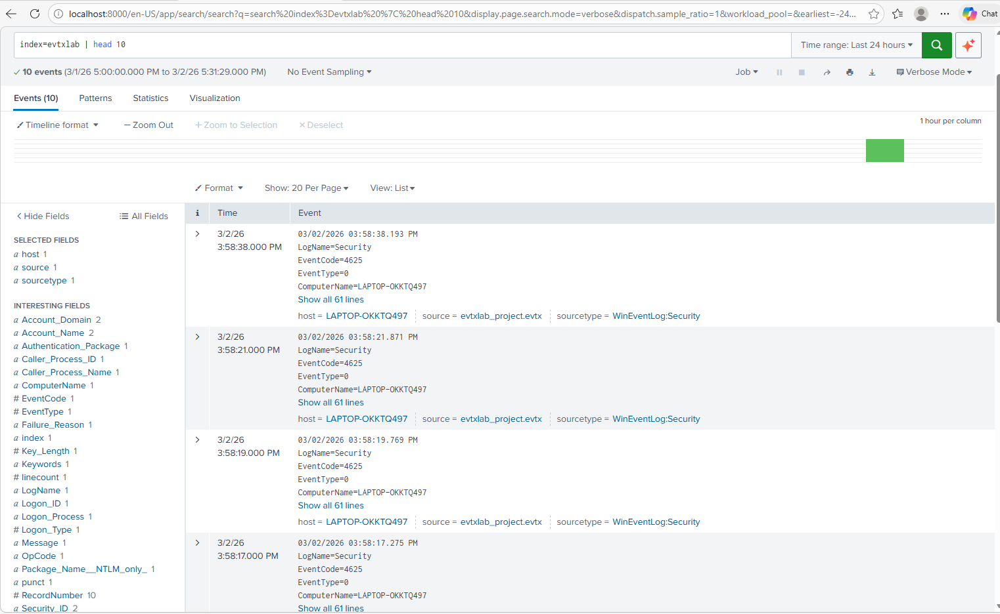

Splunk Windows Authentication Detection Lab:

Project Overview:

This project demonstrates detection of failed Windows authentication attempts using Splunk. The objective was to analyze Windows Security Event ID 4625 logs, identify suspicious login behavior, and implement threshold-based detection logic to flag potential brute force activity.

Environment:

- Windows 10 Endpoint

- Windows Security Event Logs

- Splunk Enterprise

- Custom Index: evtxlab

Detection Queries:

1. Identify Failed Logins
 ```spl
index=evtxlab (EventCode=4625 OR EventID=4625) | table _time Account_Name Logon_Type Source_Network_Address Failure_Reason | sort - _time
```


2. Count Failed Logins by User and IP
```spl
index=evtxlab (EventCode=4625 OR EventID=4625) | stats count by Account_Name Source_Network_Address | sort - count
```

3. Threshold-Based Brute Force Detection
```spl
index=evtxlab (EventCode=4625 OR EventID=4625) | bin _time span=5m | stats count as fails by Account_Name Source_Network_Address _time | where fails >= 3 | sort - fails
```

4. Failed Login Timeline (Monitoring View)
```spl
index=evtxlab (EventCode=4625 OR EventID=4625) | timechart span=5m count as failed_logins
```

Findings:

- Identified multiple failed login attempts during testing.

- Implemented threshold logic to detect repeated login failures within a 5-minute window.

- Demonstrated how detection rules can identify brute force behavior patterns.

- Built monitoring visibility using time-based analysis.


Skills Demonstrated:

- SIEM Query Writing

- Windows Event Log Analysis

- Threshold-Based Detection

- Log Correlation

- Security Monitoring
  


